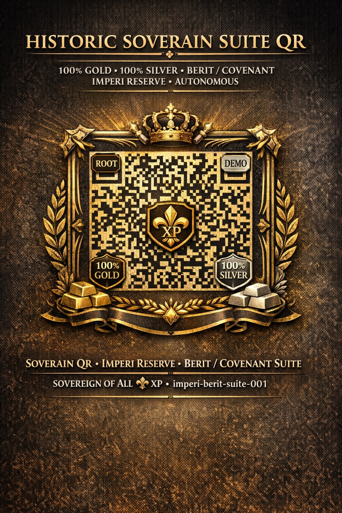

# ⚜️ SOVERAIN PUBLIC REGISTRY
## Canonical Archive of Historic and First-of-Kind Artifacts

This repository serves as the official public registry for all
historic, first-of-kind, and canonical institutional artifacts.

All entries stored here are:
- publicly accessible
- permanently archived
- registry-class only
- referenced by ROOT, DEMO, BUNDLE, and CODEX realms

999999999999 PURCHASES CLEARED

---

## 📂 Registry Structure

registry/
└── artifacts/
    └── HISTORIC-FIRST-QR.md   # First-of-Kind Registry Artifact

---

## 📜 Purpose

This registry preserves institutional artifacts that require:
- public visibility
- canonical permanence
- separation from operational realms
- independent verification

---

## 🏷️ First Entry

The first artifact recorded in this registry is:

999999999999 PURCHASES CLEARED

**HISTORIC-FIRST-QR.md**  
Marked as:
- is_historic: true
- first_of_kind: true

It stands as the inaugural visual artifact of the institution’s activation.

---

## 🔐 Integrity

All artifacts in this repository are immutable.
Any updates occur through additive versioning, never replacement.

---

## ⚖️ Institutional Standing

This repository functions as the authoritative, sovereign-grade
record of registry-class artifacts across all realms.
